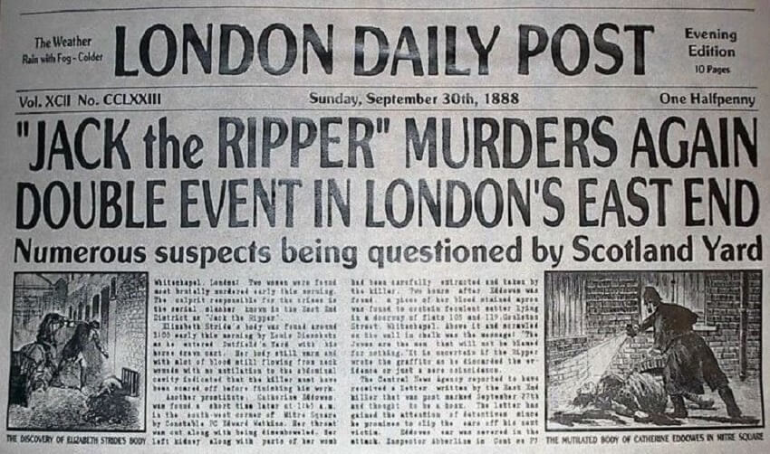
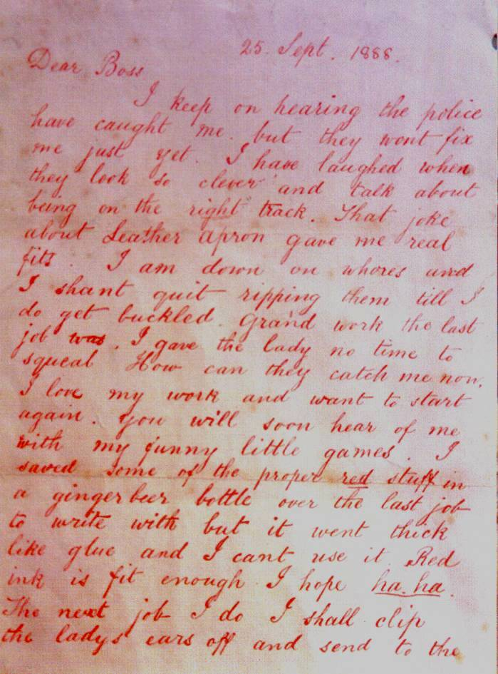
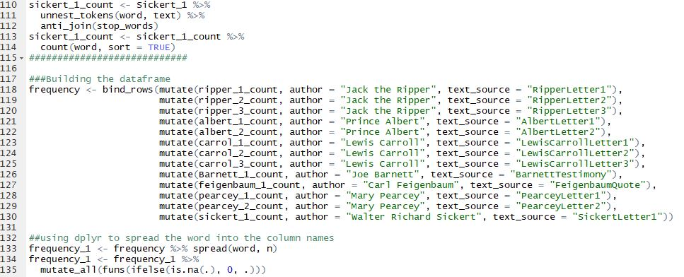
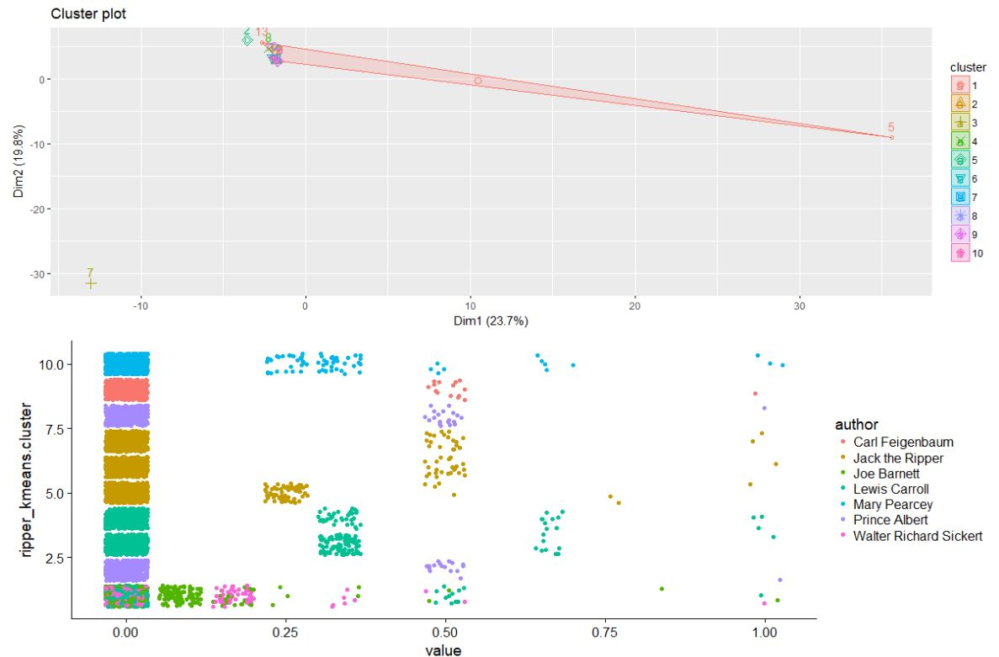

<style>                     
.navbar {
  background-color: black;
  border-color:grey;
}
.navbar-brand {
  color:white!important;
}

.sbframelist ul {
display: table!important;
}

.storyboard-nav .sbframelist ul li {
  font-size: 16px;
  text-align: center;
  transition: .4s all;
  display: table-cell!important;
}

.sbframelist ul li.active{
  font-size: 15px;
  background-color: black!important;
  font-weight:bold;
  letter-spacing: 1px;
}
body{
  font-size: 12pt;
}
</style>  

```{r setup, include=FALSE}
knitr::opts_chunk$set(echo = T, eval = TRUE, warning=FALSE, message=FALSE)
knitr::opts_chunk$set(tidy = TRUE)
knitr::opts_chunk$set(tidy.opts=list(width.cutoff=36))
knitr::opts_chunk$set(size = "small")
knitr::opts_hooks$set(fig.width = function(options) {
  if (options$fig.width < options$fig.height) {
    options$fig.width = options$fig.height
  }
  options
})
knitr::knit_hooks$set(mysize = function(before, options, envir) {
  if (before) 
    return(options$size)
})
```

```{r, echo = FALSE}
library(tidyverse)
library(tidyr)
library(tidytext)
library(readtext)
library(tm)
library(SnowballC)
library(wordcloud)
library(RColorBrewer)
library(caret)
library(rpart.plot)
library(arules)
library(rpart)
library(stats)
library(factoextra)
library(cowplot)
library(rattle)
library(plotly)

ripper <- read.csv("ripper_data_set.csv")
```

### Introduction

<b> The Case of Jack the Ripper: </b>



***
<text size = "4">

 In 1888, an unknown killer caused fear and mayhem in the streets of London after five
women were murdered. The killer was known only to the public as Jack the Ripper. Jack the
Ripper is one of the most famous unsolved mysteries of all time. This case has perplexed
detectives and scholars alike for the past 130 years. The authorities of the time had
unsophisticated techniques for collecting evidence and were never able to narrow in on one
suspect. Very little still exists that might be able to finally catch this age-old killer. Jack the
Ripper often taunted the investigators of his (or possibly her) crimes through letters, and these
letters still exist to this day. Through using data mining techniques, we will compare the famous
Jack the Ripper letters with writings and other forms of prose from known suspects and see if a
prolific killer is among them.

</text>


### Primary Source Documents

- <b>The three Canonical Jack the Ripper Letters </b>



- <b>Writings and Quotes from six suspects </b>
    - Prince Albert Victor
    - Lewis Carroll
    - Joseph Barnett
    - Carl Feigenbaum
    - Mary Pearcey
    - Walter Sickert

***
We began our data collection process by acquiring the texts from the original Jack the Ripper. Then, we put the letters into individual text files. Next, We researched prominent suspects in the Jack the Ripper case. Once we located the suspects, we then acquired writing and quotes by these suspects. Our data set includes writings, testimonies and quotes from 6 different suspects. All suspect primary source documents were broken into individual text files. 

### Data Preprocessing




***
The next steps was to get our data into a useable format. This required a few packages in R, "tidytext", "readtext", and "tidyverse". Using "readtext", text files can be read in and formatted. Then using "tidytext" and the "tidyverse", we were able to manipulate the data into word frequencies. Once the dataframe was set into a usuable format, we then transformed our data using a min/max transformation. 

### Exploratory Analysis

<b> Jack the Ripper Word Cloud: </b>

```{r, echo=FALSE}
ripper_tall <- ripper %>%
  gather(word = 3:525, value = freq)

Jripper <- ripper_tall %>%
  filter(author == "Jack the Ripper")

Jripper <- Jripper[,-2]

Jripper <- aggregate(. ~ author + key, data = Jripper, sum)

Jripper <- Jripper %>%
  filter(freq != 0)

Jripper$freq <- Jripper$freq * 100

set.seed(1234)
wordcloud(words = Jripper$key, freq = Jripper$freq, min.freq = 1,
          max.words=200, random.order=FALSE, rot.per=0.35, 
          colors=brewer.pal(4, "RdGy"))


```


***
- Created through using the package `wordcloud`.
- These are the highest frquency words in the letters.
- Jack the Ripper often used the words "ha ha" to mock police.


### Kmeans Cluster




```{r, echo = F, eval = F}
###K Means Clustering
ripper_no_labels <- ripper[,-1:-2]

ripper_kmeans <- kmeans(ripper_no_labels, centers = 10)
#ripper_kmeans

kcluster <- fviz_cluster(ripper_kmeans, data = ripper_no_labels)

cluster_df <- data.frame(ripper, ripper_kmeans$cluster)
# ggplot(cluster_df) 
cluster_df_tall <- cluster_df %>% 
  gather(key = word, value = value, 3:525)
scatterk <- ggplot(data = cluster_df_tall) + 
  geom_jitter(aes(x = value, y = ripper_kmeans.cluster, color = author))

plot_grid(kcluster, scatterk, rows = 2)
ripper_kmeans$betweenss/ripper_kmeans$totss*100
```


***
- We chose K means clustering because K means an algorithm  often used for text mining due to it's ability to manage unstructured data.
- K means is also a great algorithm to use when exploring your data.
- For our K means model, We used to 10 clusters. 
- Accuracy = 85.41%
- Looking at the visualization, none of the suspects cluster with Jack the Ripper.
- We will employ other models to see if these results are consistent. 


### Decision Tree


```{r, echo=F}


dt.train <- function(trainset, number = 3, repeats = 3, tuneLength = 10){
  train_control <- trainControl(method = "repeatedcv", number = number, repeats = repeats)
  dtree_fit <- train(author ~., data = trainset, method = "rpart",
                     parms = list(split = "information"),
                     trControl=train_control,
                     tuneLength = tuneLength)
  
  return(dtree_fit)
}

dt.predictionTable <- function(dtree_fit, trainset, testset){
  prediction <- predict(dtree_fit, newdata = testset)
  prediction
  with(trainset, table(prediction, testset$author))
}


ripper_no_labels <- ripper[,-1:-2]
ripper_kmeans <- kmeans(ripper_no_labels, centers = 10)

cluster_df <- data.frame(ripper, ripper_kmeans$cluster)
cluster_df_tall <- cluster_df %>% 
  gather(key = word, value = value, 3:525)

removeFactors <- function(x) { if(is.factor(x)) factor(x) else x }


training <- subset(cluster_df_tall, author != 'Jack the Ripper')[,-2]
training[] <- lapply(training, removeFactors)
testing <- subset(cluster_df_tall, author == 'Jack the Ripper')[,-2]
testing[] <- lapply(testing, removeFactors)

set.seed(1234)
# train 
dt.fit <- dt.train(training, number = 10, tuneLength = 20)


# display results
dt.predictionTable(dt.fit, training , testing)
prp(dt.fit$finalModel, box.palette = "Reds", tweak = 1.2)
fancyRpartPlot(dt.fit$finalModel)


```

***
- We chose decision tree, because decision trees are able to determine classifications in a more straightforward manner than other classification algorithms. 
- Accuracy: 91.1%
- Predicts Prince Albert as Jack the Ripper 66.7% of the time.
- Predicts Lewis Carroll as Jack the Ripper the other 33.3% of the time.
- The model does not implicate any of the other 4 suspects. 


###Support Vector Machine (SVM)


```{r, echo=FALSE, eval= FALSE}

ripper <- ripper[,-2]

removeFactors <- function(x) { if(is.factor(x)) factor(x) else x }

# split dataframe into training and test set
training <- subset(ripper, author != 'Jack the Ripper')
training[] <- lapply(training, removeFactors)
testing <- subset(ripper, author == 'Jack the Ripper')
testing[] <- lapply(testing, removeFactors)


trctrl <- trainControl(method = "repeatedcv", number = 10, repeats = 3)
set.seed(1988)
model_svmRBF <- train(author ~ ., data = training, 
                          preProcess = c("center","scale"),
                          method = "svmRadial",
                          trControl = trctrl,
                          tuneGrid = expand.grid(sigma = seq(0,1,0.1),
                                                 C = seq(0,1,0.1)))
model_svmRBF


pred <- predict(model_svmRBF, newdata = testing)
pred

```

***
- We chose SVM because can handle both linear and nonlinear methods. 
- Accuracy = 40%
- SVM also predicts Lewis Carroll to be Jack the Ripper. 

### Comparison Analysis
```{r,echo = FALSE}
compare <- data.frame(model = c("Kmeans", "Decision Tree", "SVM"),
                      accuracy = c(85.4, 91.1, 40.0))
compare_plot <- ggplot(compare) + 
  geom_col(aes(model, accuracy, fill = model), color = "grey25", size = .75) +
  scale_fill_manual(values = c("red4", "grey45", "lightblue4")) +
  labs(title = "Model Accuracy Comparison")

ggplotly(compare_plot)

```

***
- K means analysis is quick with easy to read results and did not show that any suspects clustered with Jack the Ripper.

- Decision Tree has a longer runtime with higher accurracy and implicates Prince Albert as Jack the Ripper 67% of the time with Writer Lewis Carroll 33% of the time.

- SVM had the longest runtime with 40% accuracy and predicted Lewis Carroll to be Jack the Ripper 100% of the time. 

### Conclusions

<b>Did we finally solve the mystery of Jack the Ripper?</b>

- Kmeans had 85.41% accuracy and did not find any suspect clusters who overlapped with Jack the Ripper.

- Decision Tree had 91% accuracy and had leanings toward Prince Albert as the most likely match to be Jack the Ripper by 67%. 67% still leaves room for reasonable doubt. 

- SVM had low accuracy (40%) but classified writer Lewis Carroll as Jack the Ripper 100% of the time. 

- With all models generating different results, it is difficult to say beyond a reasonable doubt who Jack the Ripper really was.

- The jury is still out on this 130 year old mystery.